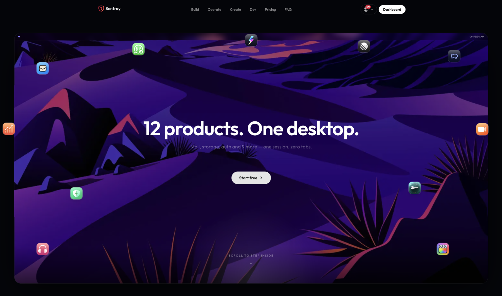
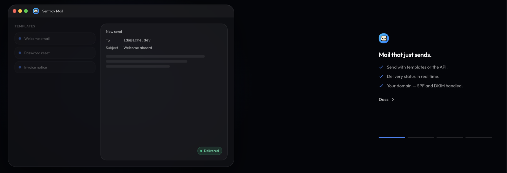
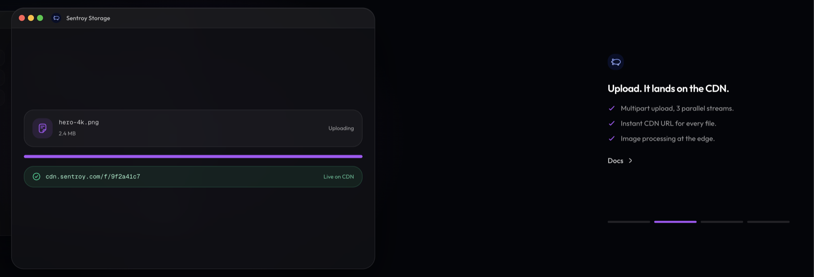

<div align="center">

<picture>
  <source media="(prefers-color-scheme: dark)" srcset="docs/assets/logo-dark.svg">
  
</picture>


### One login. One desktop. Your whole back office.

Transactional email · object storage + CDN · authentication · status pages · a
music studio · a WhatsApp inbox · encrypted backups · developer tools — tied
together by an OS-style desktop with its own App Store.
**One codebase. Run it yourself, or let us host it.**

<p>
  <a href="./LICENSE"></a>
  
  
</p>

<a href="https://sentroy.com"><b>Hosted plans</b></a> ·
<a href="./SELF-HOSTING.md"><b>Self-host it</b></a> ·
<a href="https://docs.sentroy.com"><b>Docs</b></a> ·
<a href="./CONTRIBUTING.md"><b>Contribute</b></a>

</div>

---

## Why this is source-available

Most teams stitch their back office together from a dozen SaaS logins. Sentroy is
that dozen — mail, files, auth, status, and more — behind **one account and one
desktop**.

We publish the source because a platform that holds your email, your files, and
your users' identities should be something you can read, not just trust. You
don't have to take our word for any of it: clone the repo, see exactly how it
handles sessions, secrets, and your users' data, and run the whole thing on your
own hardware. The screenshots below are the real product, not mockups.

Contributions are welcome. Self-hosted and hosted run the **exact same code**, so
every fix and feature ships to everyone running Sentroy — the people hosting it
themselves included, not just us.

## What it looks like

Every product opens in its own window on one desktop — launch, resize, stack, no
tab-juggling, one login for all of it.

<div align="center"></div>

<table>
<tr>
<td width="50%"><br><sub><b>Mail</b> — send with templates or the API, delivery status in real time.</sub></td>
<td width="50%"><br><sub><b>Storage</b> — every upload gets an instant CDN URL.</sub></td>
</tr>
</table>

## Two ways to run it

|  | **Self-host** | **Hosted at [sentroy.com](https://sentroy.com)** |
|---|---|---|
| Setup | one compose command on your box | Sign up, done |
| Your data | Stays on your servers | We operate it for you |
| Ops & updates | You run them | We handle them |
| Best for | Full control, air-gapped, learning | Skipping the server ops |

Both run the **same code**. Self-hosting is fully supported — the guide is
[SELF-HOSTING.md](./SELF-HOSTING.md). Running a multi-service platform is real
work, though, so if you'd rather not operate servers, the hosted plans exist for
exactly that. Self-hosted instances can even sync the same curated App Store
catalog from Sentroy (opt-in, cryptographically signed).

## What's inside

| | Product | What it does |
|---|---|---|
| 🖥️ | **The desktop + App Store** | The shell that ties it together: launch every product in a window, install first- and third-party apps from a signed catalog. |
| 📧 | **Mail** | Transactional email with templates, audiences, real-time delivery status, and your own domain (SPF/DKIM handled). Send from the dashboard, the API, or the SDK. |
| 🗂️ | **Storage + CDN** | Object storage with multipart upload, an instant CDN URL for every file, and image processing at the edge. |
| 🔑 | **Auth** | An OAuth 2.0 / OIDC provider *and* Auth-as-a-Service — host your own end-user pools (sign-up, login, JWTs) the way you would with Firebase Auth. |
| 🔐 | **Vault** | A secrets & environment-variable manager for your projects — encrypted at rest, pulled over an API at deploy time. |
| 📊 | **Status** | A public status page with real-time uptime, plus multi-tenant status pages for your own customers (incidents, maintenance, subscribers). |
| 🎧 | **Studio** | A DJ-first, browser-native music studio: multitrack timeline, 30+ effects, local-first projects. |
| 💬 | **WhatsApp** | A multi-number WhatsApp inbox: templates, audiences, bulk send, delivery ticks — from the dashboard or the API. |
| ✅ | **Linear Lite** | Lightweight issue triage wired to your Linear workspace. |
| 🛠️ | **Tools** | ~30 browser tools (image / PDF / audio / video / developer) that run entirely client-side, plus a media downloader. |
| 💾 | **Backup** | Scheduled, encrypted MongoDB backups with server-to-server restore and download-to-desktop. |
| 🎬 | **Video editor** | A full timeline video editor — see [the note below](#video-editor-opencut). |

## Quickstart (self-host)

```bash
git clone https://github.com/Sentroy-Co/sentroy.git && cd sentroy
cp apps/core/.env.example .env          # fill in the required values
docker compose -f docker-compose.selfhost.yaml --profile core up --build
```

Open your instance, complete the `/setup` wizard, and you have a working platform
— no external mail server required to log in. Swap the `core` profile for
`storage` (adds object storage + CDN) or `full` (the whole desktop) as you grow.
Outbound email runs on the separate mail-server stack. The full dependency
matrix, minimum profiles, and every environment variable are in
[SELF-HOSTING.md](./SELF-HOSTING.md).

## Architecture

A [Turbo](https://turbo.build) + [Bun](https://bun.sh) monorepo of
[Next.js 16](https://nextjs.org) apps sharing a component library, a data layer,
and an auth/permissions engine.

**Apps** — `core` (platform, dashboard, docs, App Store, the desktop), `mail`,
`storage`, `auth2`, `status`, `studio`, `whatsapp` (+ `whatsapp-gateway`),
`linear`, `downloader`, `backup`, `cdn`.

**Packages** — `@workspace/ui` (shadcn primitives), `@workspace/db`,
`@workspace/auth`, `@workspace/console` (dashboard shell + server helpers),
`@workspace/cdn-client`, `@workspace/ai-assistant`, and
`@workspace/app-manifest` (the App Store manifest contract, MIT-licensed so
anyone can build apps against it).

One cross-subdomain single sign-on, a single `ROOT_DOMAIN` knob, and a signed App
Store registry let the whole platform run cleanly on any domain you point it at.

## Video editor (OpenCut)

The timeline video editor lives in its own repository:
**[Sentroy-Co/opencut-sentroy-edition](https://github.com/Sentroy-Co/opencut-sentroy-edition)**.
It runs as a companion service and slots into the Sentroy desktop over
single-sign-on. To offer it on your instance, deploy that repo alongside this one
and point the desktop at it — details in [SELF-HOSTING.md](./SELF-HOSTING.md).

## Develop

```bash
bun install
bun run dev          # every app in parallel
bun run typecheck
bun run build
```

New to the codebase? [CONTRIBUTING.md](./CONTRIBUTING.md) has the dev setup and
conventions; [docs.sentroy.com](https://docs.sentroy.com) covers the APIs and the
App Store manifest spec.

## Contributing & security

- [CONTRIBUTING.md](./CONTRIBUTING.md) — dev setup, PR rules, the contributor agreement
- [SECURITY.md](./SECURITY.md) — report a vulnerability privately
- [CODE_OF_CONDUCT.md](./CODE_OF_CONDUCT.md)

## License

**Fair Source, not open source.** Sentroy is licensed under the
[Functional Source License (FSL-1.1-ALv2)](./LICENSE): use it, modify it, and
self-host it for your own purposes freely. What it does **not** permit is a
_Competing Use_ — making Sentroy available to others in a commercial product or
service that substitutes for it (or for another Sentroy product), or that offers
substantially the same functionality, hosted or not. The [LICENSE](./LICENSE)
holds the controlling definition. Each release automatically converts to
Apache-2.0 two years after it ships.

Carve-outs: `apps/whatsapp-gateway/` is GPL-3.0-or-later and
`packages/app-manifest/` is MIT (see [NOTICE](./NOTICE)). The **Sentroy name and
logos are not covered by the code license** — if you fork it, rebrand it. See
[TRADEMARK.md](./TRADEMARK.md).

<div align="center"><sub>Built by the Sentroy team · <a href="https://sentroy.com">sentroy.com</a></sub></div>
